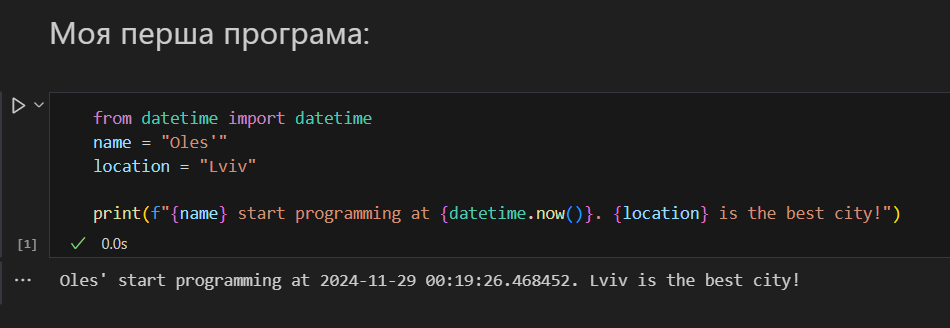

# Звіт до роботи 1
## Тема: Оформлення робіт та перша програма
### Мета роботи: Оформити свою першу роботу та створити першу програму

---
## Виконання роботи
* ### Результати виконання завдань:
    1. Створив репозиторій, [оформив його](https://github.com/okukharyk/Python).
    1. Попрацював із репозиторієм та інтегрував його із Visual Studio Code;
    1. Написав першу програму Python та [запустив її](./main.py):
    

    1. Написав другу та третю програми Python та [запустив їх](./main.ipynb):
    

---

## Висновок:

- Створено та оформлено репозиторій. Ознайомився із форматуванням Markdown. 
- Досягнуто мету роботи: Оформити свою першу роботу та створити першу програму
- Отримано нові знання: як працювати з Github, форматуванням Markdown та як створювати та зручно оформлювати репозиторій. 

---
⠀⠀⠀⠀