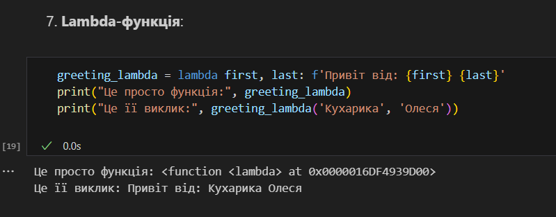

# Звіт до роботи 2
## Тема: Основи програмування на Python  
### Мета роботи: Ознайомитися із основами програмування на Python.

---

## Виконання роботи

* ### Результати виконання завдань:
    1. Створив [файл](./main.ipynb) із базовими прикладами Python-коду для ознайомлення з типами даних та основними конструкціями;
    1. Ознайомився із циклами `for` і `while`, конструкціями `if` та `try-except`та із контекст-менеджером `with`;
    1. Створив Lambda-функцію ([Пункт 7](./main.ipynb)) та протестував її виконання:
    

---

## Висновок:

- Виконано базові вправи для ознайомлення із конструкціями на Python.
- Досягнуто мету роботи: Ознайомитися із основами програмування на Python.
- Отримано знання про різноманітні дані та функції.

---